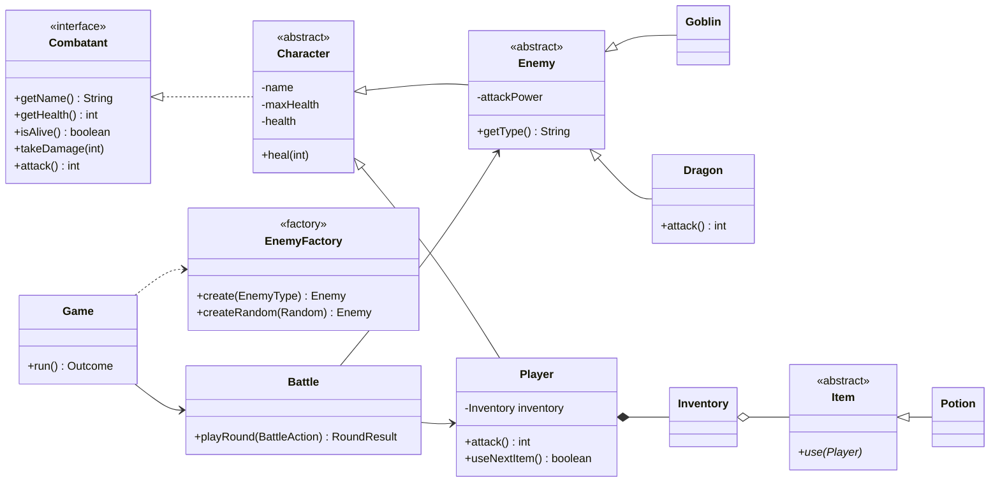

# Console Adventure Game (Java, OOP)

A turn-based text RPG played in the terminal. The project is built to show Object-Oriented
Programming in practice: **inheritance, polymorphism, encapsulation and abstraction**, plus
two classic design patterns (**Factory Method** and **dependency injection**).

## How to run

Requires JDK 17+.

```bash
javac -d out $(find src -name "*.java")
java -cp out com.game.main.GameApp
```

On Windows (PowerShell):

```powershell
javac -d out (Get-ChildItem -Recurse src -Filter *.java).FullName
java -cp out com.game.main.GameApp
```

Run the test suite (no external libraries needed):

```bash
javac -d out $(find src test -name "*.java")
java -cp out com.game.GameTests
```

## Gameplay

* Every encounter spawns a random enemy: a **Goblin** (50 HP, hits for 15) or a **Dragon**
  (120 HP, breathes for 35).
* Each round you can **Attack** (20 damage), **Use an item**, or **Run away**.
* Defeating an enemy drops a **Healing Potion** (restores 20 HP, max 100 HP).
* The game ends when your health reaches 0, or when you choose **Quit**.

## Architecture

```
src/com/game/
├── main/GameApp.java          entry point, wires the objects together (manual DI)
├── model/                     the "domain": what the game is made of
│   ├── Combatant.java         interface: anything that can fight
│   ├── Character.java         abstract base: name, health, damage and healing rules
│   ├── Player.java            extends Character, owns an Inventory
│   ├── Enemy.java             abstract, extends Character, declares attack strength
│   ├── Goblin.java / Dragon.java   concrete enemies, each overrides attack()
│   ├── Item.java              abstract item with an abstract use(Player)
│   ├── Potion.java            concrete item
│   └── Inventory.java         encapsulated FIFO storage for items
├── factory/EnemyFactory.java  Factory Method: creates enemies by type or at random
├── service/                   the rules of play
│   ├── Battle.java            one fight, round by round; records events, prints nothing
│   ├── BattleAction.java      enum of the player's choices
│   └── Game.java              the game loop across encounters
└── ui/
    ├── ConsoleView.java       all printing lives here
    └── InputReader.java       validated input (re-prompts instead of crashing)

test/com/game/GameTests.java   31 checks, JDK only
```

### Class diagram



## OOP concepts, mapped to the code

| Pillar | Where to look | What it demonstrates |
|---|---|---|
| **Encapsulation** | `Character` (`health` is `private`), `Inventory` (wraps the `Deque`) | State changes only through rules: `takeDamage` clamps at 0, `heal` caps at max, and callers can't reach the internal collection. |
| **Inheritance** | `Character → Player / Enemy`, `Enemy → Goblin / Dragon`, `Item → Potion` | Health logic is written once in `Character`. Subclasses reuse it and add only what differs. |
| **Polymorphism** | `Combatant.attack()`, overridden in `Goblin`, `Dragon` and `Player`; `Battle.hit(Combatant, Combatant)` | `Battle` handles any combatant without knowing its concrete type. `Dragon` adds breath damage through overriding. |
| **Abstraction** | `Combatant` (interface), `Enemy` and `Item` (abstract classes) | Callers depend on what an object *can do*. Abstract methods force every subclass to define its own behaviour. |
| **Factory Method** | `EnemyFactory.create(...)` | Creation is centralised. A new enemy needs one enum value and one case, and the game loop is unchanged (open/closed principle). |
| **Separation of concerns** | `Battle` returns events, `ConsoleView` prints them, `InputReader` validates input | Game rules can be unit-tested without a terminal. |
| **Dependency injection** | `Game(player, input, view, random)` | Randomness and input are passed in, so tests are deterministic. |

## Design decisions (good to discuss in an interview)

* **Why an interface *and* an abstract class?** `Combatant` is the contract that `Battle` uses.
  `Character` is the shared implementation. This lets a future fighter (for example an NPC ally)
  implement only the interface, and it still gets to reuse the abstract base if it wants.
* **Why does `Battle` not print?** Printing is a UI concern. Keeping `Battle` silent means
  the same rules could run in a GUI or a web front end.
* **Why `InputReader` instead of `Scanner.nextInt()`?** `nextInt()` throws
  `InputMismatchException` on letters and crashes the game. The reader re-prompts instead.
* **Why is `Random` injected?** With a fixed seed, tests can assert exact results.

## Possible extensions

* Add a `Weapon` class that extends `Item` and changes `Player.attack()`.
* Give `Enemy` an XP value and add levelling to `Player`.
* Save and load the game using the `Serializable` interface.
